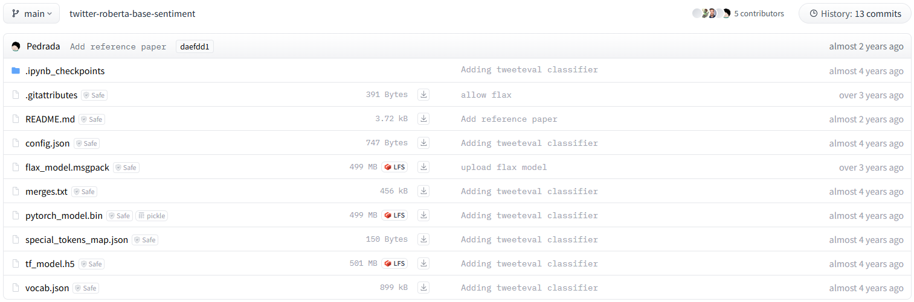

# Requirements:
- Python 3.11.10 (tested and working for sam, does not mean other versions will not work)
    - `pip install -r requirements.txt`
- CUDA (For faster inferance)
- spaCy (https://spacy.io/usage)
    - select the english model, `python -m spacy download en_core_web_sm`
- Pytorch (https://pytorch.org/get-started/locally/)
- Hugging face twitter/X roBERTa model (https://huggingface.co/cardiffnlp/twitter-roberta-base-sentiment/tree/main), download all files (except ipynb_checkpoints) and place in the same directory as the script under `cardiffnlp/twitter-roberta-base-sentiment`

    

# Usage:
Refer to `sentiment_analysis.ipynb` for usage example
```python
from utils import get_sentiment

df = pd.read_csv(df_path)

df["sentiment"] = df.apply(lambda x: get_sentiment(x[target_column]), axis=1)
df["negative"] = df["sentiment"].apply(lambda x: x["negative"])
df["neutral"] = df["sentiment"].apply(lambda x: x["neutral"])
df["positive"] = df["sentiment"].apply(lambda x: x["positive"])
```
