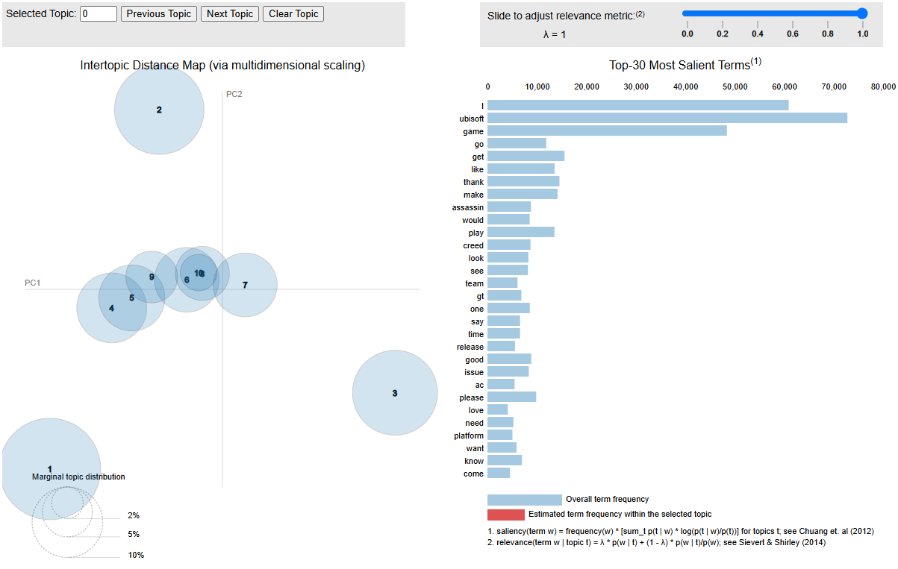

# Requirements:
- Python 3.11.10 (tested and working for sam, does not mean other versions will not work)
    - `pip install -r requirements.txt`
- spaCy (https://spacy.io/usage)
    - select the english model, `python -m spacy download en_core_web_sm`

# Usage:
Refer to `topic_model.ipynb` for usage example
```python
# set your csv path and target column
df = pd.read_csv(df_path)
texts = df['target_column'].astype(str).tolist()

# Set according to your needs
num_topics = 10
passes = 15
random_state = 42
```

# Interpreting Results:
## Genism
1. ### Coherence:
    ```python
    # Compute Coherence Score
        coherence_model_lda = CoherenceModel(model=lda_model, texts=tokenized_texts, dictionary=dictionary, coherence='c_v')
        coherence_score = coherence_model_lda.get_coherence()
        print(f'Coherence Score: {coherence_score}')
    ```
    - Low Coherence (<0.4): Topics may be incoherent or not meaningful.
    - Moderate Coherence (0.4 - 0.6): Topics are somewhat interpretable but may need refinement.
    - High Coherence (>0.6): Topics are generally coherent and meaningful.

2. ### Perplexity
    ```python
    perplexity = lda_model.log_perplexity(corpus)
    print(f'Perplexity: {perplexity}')
    ```
    - Lower Perplexity: Better model performance.
    - Perplexity is not a standalone metric, it should be used in conjunction with coherence scores.

3. ### Visualizing Topics
    
    - Left Panel (Intertopic Distance Map): Shows topics as circles; the distance between them indicates similarity.
    - Right Panel (Top Words): Displays the top words for the selected topic, helping you understand its theme.

## BERTopic
1. ### General information
    ```python
    topic_model.get_topic_info()
    ```
    

